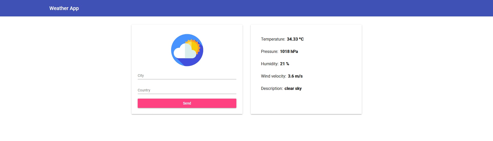

# TypeScript Angular Material

This project was generated with NodeJS. To test it, please set the `Open Weather API Key` into `backend/configs/index` file and make sure to put the absolute url of the development server into `frontend/src/app/services/weather.service` file.

Weather Web Application using Open Weather API. FullStack.

## Development server

Change directory with `cd ./backend` or `cd ./frontend`. Run `npm run dev` for a dev backend server. Navigate to `http://localhost:3000/`. Run `npm start` for a dev frontend server with angular. Navigate to `http://localhost:4200/`. The app will automatically reload if you change any of the source files.